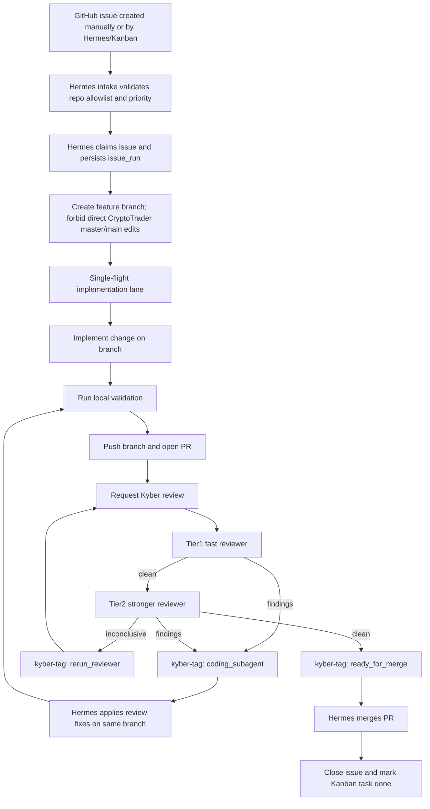

# Architecture

## Summary

KyberM0nk is a project orchestration system. It takes a repository and matures it from its current state into a production-ready project by orchestrating GitHub issues and PRs through a pipeline of agentic frameworks.

The active stack: **Hermes** (orchestration brain) + **Aider** (execution worker) + **Guardian** (local model). Cryptotrader is the testing playground — the same pipeline matures any project.

Hermes assigns one issue at a time to the coding-agent lane, which resolves the issue in a PR and hands it off with `ready_for_review` before the review loop starts.

```text
+--------------------------------------------------+
| Project Maturity Lifecycle                       |
| Diagnose → Stabilize → Structure → Automate →    |
| Polish → Sustain                                 |
+-------------------+------------------------------+
                    |
                    v
+-----------------------------------+
| KyberM0nk Control Plane           |
| - docs                            |
| - configs                         |
| - scripts                         |
| - host services                   |
+----------------+------------------+
                 |
                 v
+-----------------------------------+
| Hermes (Orchestration Brain)      |
| - CLI / Telegram / webhook        |
| - cron governance loops           |
| - issue triage & PR management    |
| - SQLite queue                    |
| - maturity tracking               |
+----------------+------------------+
                 |
                 v
+-----------------------------------+
| Aider (Execution Worker)          |
| - single-flight lease             |
| - active project worktree         |
| - opens PRs, fixes issues         |
+----------------+------------------+
                 |
                 v
+-----------------------------------+
| Validation + Review               |
| - local checks                    |
| - tier1 reviewer                  |
| - tier2 reviewer                  |
| - kyber-tag routing               |
+----------------+------------------+
                 |
                 v
+-----------------------------------+
| Guardian proxy                    |
| http://127.0.0.1:11434/v1         |
+----------------+------------------+
                 |
                 v
+-----------------------------------+
| llama.cpp backend                 |
| 127.0.0.1:11440                   |
| Managed by Guardian only          |
+-----------------------------------+
```

## Active Workflow



Issue handling is part of the default flow: Hermes receives and triages a new
issue, routes it into the coding lane, and only enters the PR review loop after
the coding agent has pushed the solution and marked the PR `ready_for_review`.
The intended steady state is fully autonomous: **issue intake → branch → PR →
multi-round review → fix loop → merge → issue closure → Kanban done** without
manual intervention for routine steps.

For CryptoTrader specifically, direct commits or uncommitted implementation work
on `master`/`main` are treated as pipeline violations. Recovery work must be
moved to a feature branch, pushed, reviewed through a PR, and merged only after
review gates pass.

### Autonomous pipeline responsibilities

| Stage | Owner | Required behavior |
|-------|-------|-------------------|
| Intake | Hermes Gateway / GitHub sync | Detect eligible open issues and sync them to Kanban with repo, issue, priority, and workspace metadata. |
| Claim | Hermes queue | Claim one eligible issue at a time, persist `issue_runs`, and avoid duplicate active work for the same issue. |
| Branch | Hermes implementation lane | Create or reuse a feature branch named for the issue/task; never implement directly on CryptoTrader `master`/`main`. |
| Implement | Aider/local coding worker | Apply scoped changes on the branch, commit atomically, and push to GitHub. |
| PR | Hermes PR manager | Open or update a PR with issue link, summary, validation, and risk notes. |
| Review | Kyber review agent | Run bounded Tier1/Tier2 review, post inline/anchored findings when possible, and emit `kyber-tag` routing. |
| Fix loop | Hermes + coding worker | Convert `review_findings` into concrete branch edits, push fixes, and rerun review until clean or blocked. |
| Merge | Hermes PR manager | Merge only after `ready_for_merge`, passing checks, and no unresolved review-findings tag. |
| Closure | Hermes/Kanban sync | Close the source issue, write audit comments, and mark the Kanban task done. |

Manual intervention is reserved for explicit blockers: missing credentials,
unsafe live-capital risk, ambiguous product decisions, broken provider routing,
or repeated validation failure after bounded retries.

## Durable State

- Hermes persists issue-resolution runs in `~/.hermes/issue_resolution.db`.
- The active run states are `queued`, `running`, `expanded`, `completed`, and `failed`.
- Local coder execution is FIFO and single-flight to protect the one meaningful local inference lane.

### SQLite schema surface

The queue state machine is backed by:

- `issue_runs`: run metadata (`repo`, `issue_number`, `workdir`, `status`, `run_type`, `attempt_count`, `next_attempt_at`, `pr_number`, `pr_url`, timestamps).
- `master_subissues`: decomposition mapping between master runs and generated sub-issues.

The canonical field-level behavior is documented in `docs/GITHUB_ISSUE_RESOLUTION.md`.

### Hermes <-> Aider envelope

Hermes invokes Aider with a strict role envelope:

1. Build normalized issue context and run-scoped prompt.
2. Select role profile (`local_coder`, `tier1_reviewer`, `tier2_reviewer`).
3. Inject provider endpoint and key from environment (`OPENAI_API_BASE`/`OPENAI_API_KEY`).
4. Execute Aider non-interactively against the claimed worktree.
5. Parse output into status + review routing (`kyber-tag`) for PR manager consumption.

This envelope is intentionally deterministic so queue retries and resume behavior remain reproducible.

## Boundary Decisions

### Host-native defaults

- Guardian proxy
- `llama-server`
- Hermes Gateway daemon and persisted automation state
- Aider runtime
- optional available operator tools such as Claude Code, OpenCode, CrewAI,
  Superset, and Agent Zero (outside the default active flow unless explicitly enabled)
- GGUF model files plus GPU allocation and tensor split policy

### Optional containers

- Docker may still be used for bounded experiments or deployable targets.
- Docker is not the default Kyber runtime path and must not define the architecture narrative.

## Mount Model

The stack should use three mount categories:

| Mount | Access | Purpose |
|-------|--------|---------|
| Active project | read-write | The project being edited |
| Reference projects | read-only | Context and pattern lookup |
| KyberM0nk config | read-only or read-write per service | Tool config and logs |

The default must avoid accidental write access to reference repositories.

## Model Routing

All tools should use an OpenAI-compatible endpoint:

```text
GUARDIAN_BASE_URL=http://127.0.0.1:11434/v1
```

The initial deep model alias is:

```text
qwen3-35b-uncensored
```

Guardian remains the source of truth for actual model paths, context sizes, VRAM policy, pinned model behavior, and switch allowlists.

## Optional Agent Model Budgets

When optional lanes are enabled, KyberM0nk tools should use balanced
coding-agent budgets rather than maximum stress-test budgets.

Default policy:

- OpenCode: `65536` context, `4096` max tokens, `0.2` temperature.
- Agent Zero chat: `65536` context with `ctx_history: 0.35`, `1536` output cap, and `240s` timeout.
- Agent Zero utility: `32768` context with `ctx_input: 0.35`, `1024` output cap, and `180s` timeout.
- Avoid `32768` output-token caps for normal autonomous coding tasks.

The benchmark suite and trend renderer in `scripts/` provide the evidence trail for changing these values.

## Non-Goals

- KyberM0nk does not replace Guardian.
- KyberM0nk does not download or manage GGUF model files.
- KyberM0nk does not start direct `llama-server` processes.
- KyberM0nk does not replace project-specific workspaces; it coordinates frameworks around them. See [WORKSPACE_POLICY.md](WORKSPACE_POLICY.md).

## PR Review Control Loop

Kyber PR automation uses a two-tier Aider reviewer lane and tag-driven routing:

1. Tier1 reviewer (Aider + fast OR model) evaluates the PR and posts findings.
2. If Tier1 is clean, Tier2 reviewer (Aider + stronger OR model) re-checks.
3. PR comments include machine-readable PR-manager tags with:
   - `state`: `review_findings`, `review_clean`, or `review_inconclusive`
   - `next_action`: `coding_subagent`, `ready_for_merge`, or `rerun_reviewer`
4. The PR manager executes the next step from tags.

GitHub Copilot mentions are intentionally excluded from this lane.

## See Also

- [ISSUE_TO_MERGE_TARGET_STATE.md](ISSUE_TO_MERGE_TARGET_STATE.md) — complete target state: state machine, routing contracts, failure handling, and runnable checklist.
- [GITHUB_ISSUE_RESOLUTION.md](GITHUB_ISSUE_RESOLUTION.md) — detailed implementation of the Hermes Gateway issue lane.
