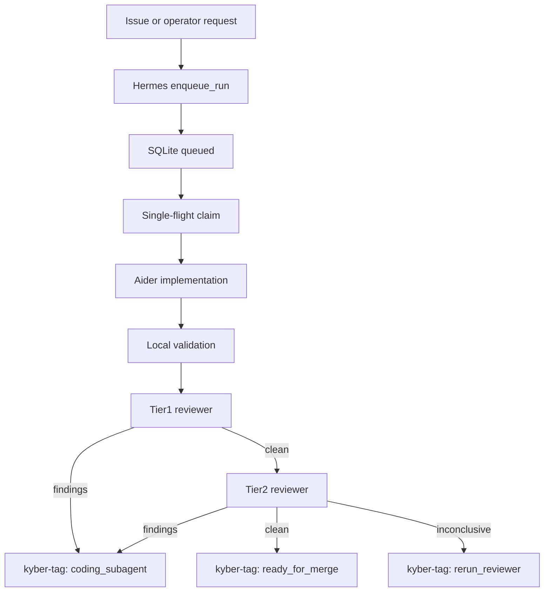

# Architecture

## Summary

KyberM0nk is a headless, host-native automation control plane. The active
production path is Hermes for durable orchestration, Aider for code changes,
Guardian for local model brokering, and a PR-manager loop driven by
machine-readable `kyber-tag` review comments.

```text
+------------------------------+
| Operator Events              |
| CLI / Telegram / Webhooks    |
+---------------+--------------+
                |
                v
+-----------------------------------+
| KyberM0nk Control Plane           |
| - docs                            |
| - configs                         |
| - scripts                         |
| - host services                   |
+----------------+------------------+
                 |
                 v
+-----------------------------------+
| Hermes Gateway                    |
| - CLI / Telegram / webhook        |
| - cron                            |
| - SQLite queue                    |
| - PR manager                      |
+----------------+------------------+
                 |
                 v
+-----------------------------------+
| Aider local coder                 |
| - single-flight lease             |
| - active project worktree         |
+----------------+------------------+
                 |
                 v
+-----------------------------------+
| Validation + Review               |
| - local checks                    |
| - tier1 reviewer                  |
| - tier2 reviewer                  |
| - kyber-tag routing               |
+----------------+------------------+
                 |
                 v
+-----------------------------------+
| Guardian proxy                    |
| http://127.0.0.1:11434/v1         |
+----------------+------------------+
                 |
                 v
+-----------------------------------+
| llama.cpp backend                 |
| 127.0.0.1:11440                   |
| Managed by Guardian only          |
+-----------------------------------+
```

## Active Workflow



## Durable State

- Hermes persists issue-resolution runs in `~/.hermes/issue_resolution.db`.
- The active run states are `queued`, `running`, `expanded`, `completed`, and `failed`.
- Local coder execution is FIFO and single-flight to protect the one meaningful local inference lane.

### SQLite schema surface

The queue state machine is backed by:

- `issue_runs`: run metadata (`repo`, `issue_number`, `workdir`, `status`, `run_type`, `attempt_count`, `next_attempt_at`, `pr_number`, `pr_url`, timestamps).
- `master_subissues`: decomposition mapping between master runs and generated sub-issues.

The canonical field-level behavior is documented in `docs/GITHUB_ISSUE_RESOLUTION.md`.

### Hermes <-> Aider envelope

Hermes invokes Aider with a strict role envelope:

1. Build normalized issue context and run-scoped prompt.
2. Select role profile (`local_coder`, `tier1_reviewer`, `tier2_reviewer`).
3. Inject provider endpoint and key from environment (`OPENAI_API_BASE`/`OPENAI_API_KEY`).
4. Execute Aider non-interactively against the claimed worktree.
5. Parse output into status + review routing (`kyber-tag`) for PR manager consumption.

This envelope is intentionally deterministic so queue retries and resume behavior remain reproducible.

## Boundary Decisions

### Host-native defaults

- Guardian proxy
- `llama-server`
- Hermes Gateway daemon and persisted automation state
- Aider runtime
- optional operator tools such as Claude Code, OpenCode, CrewAI, Superset, and Agent Zero
- GGUF model files plus GPU allocation and tensor split policy

### Optional containers

- Docker may still be used for bounded experiments or deployable targets.
- Docker is not the default Kyber runtime path and must not define the architecture narrative.

## Mount Model

The stack should use three mount categories:

| Mount | Access | Purpose |
|-------|--------|---------|
| Active project | read-write | The project being edited |
| Reference projects | read-only | Context and pattern lookup |
| KyberM0nk config | read-only or read-write per service | Tool config and logs |

The default must avoid accidental write access to reference repositories.

## Model Routing

All tools should use an OpenAI-compatible endpoint:

```text
GUARDIAN_BASE_URL=http://127.0.0.1:11434/v1
```

The initial deep model alias is:

```text
qwen3-35b-uncensored
```

Guardian remains the source of truth for actual model paths, context sizes, VRAM policy, pinned model behavior, and switch allowlists.

## Agent Model Budgets

KyberM0nk tools should use balanced coding-agent budgets rather than maximum stress-test budgets.

Default policy:

- OpenCode: `65536` context, `4096` max tokens, `0.2` temperature.
- Agent Zero chat: `65536` context with `ctx_history: 0.35`, `1536` output cap, and `240s` timeout.
- Agent Zero utility: `32768` context with `ctx_input: 0.35`, `1024` output cap, and `180s` timeout.
- Avoid `32768` output-token caps for normal autonomous coding tasks.

The benchmark suite and trend renderer in `scripts/` provide the evidence trail for changing these values.

## Non-Goals

- KyberM0nk does not replace Guardian.
- KyberM0nk does not download or manage GGUF model files.
- KyberM0nk does not start direct `llama-server` processes.
- KyberM0nk does not replace project-specific workspaces; it coordinates frameworks around them. See [WORKSPACE_POLICY.md](WORKSPACE_POLICY.md).

## PR Review Control Loop

Kyber PR automation uses a two-tier Aider reviewer lane and tag-driven routing:

1. Tier1 reviewer (Aider + fast OR model) evaluates the PR and posts findings.
2. If Tier1 is clean, Tier2 reviewer (Aider + stronger OR model) re-checks.
3. PR comments include machine-readable PR-manager tags with:
   - `state`: `review_findings`, `review_clean`, or `review_inconclusive`
   - `next_action`: `coding_subagent`, `ready_for_merge`, or `rerun_reviewer`
4. The PR manager executes the next step from tags.

GitHub Copilot mentions are intentionally excluded from this lane.
